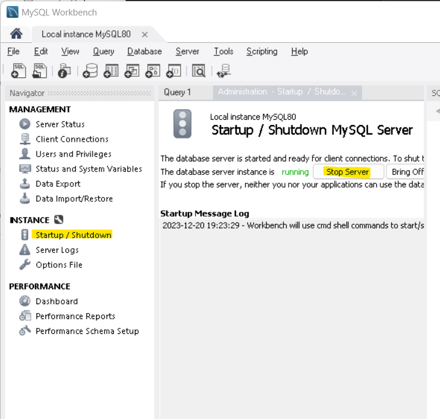

# SQL Tutorial

A repo to learn SQL.

## Installing MySQL

Download MySQL community web installer @ <https://dev.mysql.com/downloads/installer/> and choose the web installer.

In teh options Install choose Full and downlaod and install all components

For thew root password enter something such as: ********

## Running MySQL

Open MySql Workbench from the Start Menu

Open the `local instance` and from the menu bar on the left choose under instance startup/shutdown and press the button to start the server

To work with the database choose the tab schemas.

